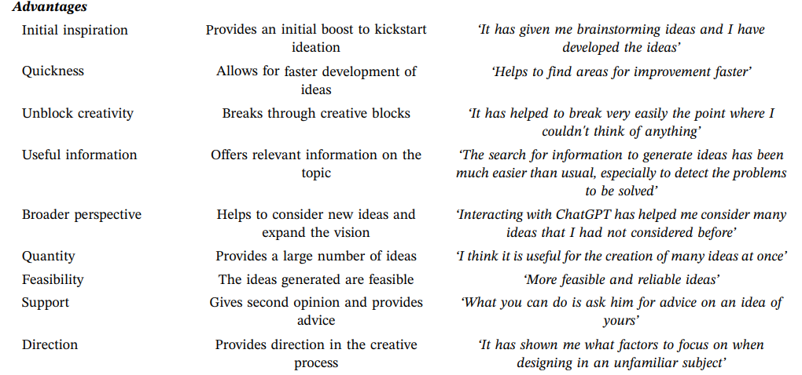

# IDEATION

# 목적

- Ideation 과정 중 사용자의 divergent thinking을 유도하여 creativity를 높일 수 있는 HAI 시스템 제안 및 구현
- Geneplore을 돕는 Human-AI Creativity System
- 뼈대 논리: 시스템이 geneplore의 generate - explore - loop를 어떻게 공간화/외재화해서 지원하는가
    - user evaluation에서 보면 좋을 것: 사람들의 preinventive structure가 이 시스템을 통해 얼마나 **비(非)텍스트적/다양하게 나타나는지**를 검증 → 실제 과업의 창의성 영향?

# Background

## AI supported Ideation

- 과거 연구들은 Creativity가 Ideation과 큰 연관이 있음을 입증 (Akin, 1990; Atman et al., 1999; Brophy, 2001; Cross, 2001; Kim & Maher, 2023). Ideation 단계가 작업의 creativity를 높이는 데에 중요.
- AI는, 창작의 초기 단계에 사용시 creativity를 boost하는 데에 도움을 준다는 연구 결과 존재 (Chandrasekera et al., 2025; Kim et al., 2021)
- Human-AI Co-Creation에서 AI는 주로 ideation 단계에서 사용자들에게 insight를 주고 initial boost의 역할을 하는 데에 유용하다고 평가됨 (Balta-Salvador et al., 2025)

그러나 기존 연구들은 대부분 아래의 단계에 머무름

- creative task에서 AI를 사용하는지 안하는지(혹은 human-led인지 ai-led인지)의 효과 검증 (broad)
- 특정 분야 (예: 디자이너들의 concept 설정작업, scriptwriting)에만 한정된 creative tool (narrow)

따라서..

⇒ ‘Ideation’ 자체에 도움을 어떻게 줄 수 있는지

⇒ 어떤 인터페이스나 상호작용 요소를 활용할 수 있을지

⇒ 실제로 creative task에서 ai 기반 ideation tool이 효과가 있을지

에 대해서는 연구 부족

### AI 활용 창작 시 문제점들

비록 ideation 단계에서 AI를 활용하는 것이 insight를 주는 데에 도움을 준다고 하지만, 상반된 연구결과 (예. Qin et al., 2025) 존재.

⇒ 단순히 ‘초기단계에 AI를 활용’하는 것이 좋다기보다는 ‘어떻게 활용하는지’가 중요

대표적인 문제점들

- **idea fixation**: 한 가지 아이디어 틀에만 고착
    - using an AI image generator as a source of inspiration by novice designers led to higher design fixation on an initial example and lower fluency, variety, and originality of ideas compared to using a conventional image search or no inspiration support. We suggest that fixation can happen in how the brief andthe example influence the prompt given to the AI system, how the system translates it into images, and how the images inspire participants’ ideas. (Wadinambiarachchi et al., 2024)
- **homogenization**: ai를 쓰면 스타일이 다 비슷해지고 아이디어 평준화 (Anderson et al., 2024; DiStefano & Beaty, 2025; Moon et al., 2024; Sourati et al., 2025)
- **cognitive offloading**: ai의 automatioin으로 인한 cognitive engagement의 감소, overreliance (Lee & See, 2004; Zamfirescu-Pereira et al., 2023)

### 생각의 시작

⇒ AI가 더 많이 생성해주는 것보다, 사용자가 ‘자기 생각을 더 들여다보게 만드는’ 디자인이 좋지 않을까?

⇒ AI가 직접 창작 아이디어를 만들어주는 것보다 사람들의 창의적 발상과정을 support하는 ai 시스템이 필요하지 않을까?

### 창의성에 관한 기본 전제

Boden (2004): Sometimes, creativity is the combination of familiar ideas in unfamiliar ways. In other cases, it involves the exploration – and sometimes the transformation – of conceptual spaces in people’s minds.

- 조합(combinational), 탐색(exploratory), 변형(transformational)
- 창의성이란, conceptual space를 explore하고 transform하며 combine함으로써 새로운 인공물을 만들어내는 능력

# Geneplore Model

# 단계에 관한 큰 틀:
Geneplore Model (Finke, Ward, and Smith, 1992)

## 이론의 기본 아이디어와 전제

- “사람 머릿속에서 아이디어가 어떻게 표상, 조작되는지”를 설명하는 인지 메커니즘 모델 중 하나
    - Divergent-Convergent Thinking / Dual pathway to creativity model 같은 거대 이론들은 “넓게 vs 깊게”와 같은 매크로한 차원만 다루지만, Geneplore는 실제로 어떤식으로 사고가 이루어지는지를 미시적으로 설명
- 사람들은 ‘처음부터 완전한 아이디어’를 내는 것이 아니라, ‘preinventive sturctures’(미완성 구조)를 만들고, 그것을 여러 방식으로 해석/변형하면서 창의적 산출물에 도달한다는 관점
- ‘creative cognition’ 이론의 핵심 모델로, 창의 과정을 generate 단계와 explore 단계의 루프로 보는 것이 포인트

## 두 단계: Generate & Explore

### **1. Generative Process**

- preinventive structure(재료)의 생성 단계
    - The term preinventive is used to denote a germ of an idea, a “half-baked” sketch, or a design hunch that may hold promise. Patterns, 3D models and conceptual combinations (Ibid.) that prefigure creative concepts are all examples of preinventive structures. (Bradner et al., 2014)
- 이 단계에서 사람은 문제를 완전히 명시하지 않았거나 목표가 느슨한 상태에서, 여러 인지 전략을 통해 아이디어의 재료가 되는 구조물을 만듦
    - 즉, ‘정답 아이디어’가 아니라, 나중에 갖고 놀 수 있는 스케치/형태/개념 묶음을 먼저 만드는 단계
- generative process 예시
    - Retrieval (회상): 기억에서 관련 개념·이미지 끌어오기
    - Association (연합): 연상 확장, 개념 간 연결 만들기
    - Synthesis (종합): 서로 다른 요소를 결합해 새로운 형태 만들기
    - Transformation (변형): 회전, 크기 변경, 왜곡 등 형태 변환
    - Analogical transfer (유추적 전이): 다른 영역의 구조를 가져와 비유·유추
    - Categorical reduction (범주적 축약): 범주를 축소하거나 핵심 특징만 남기기
- preinventive sturcture의 유형 예시
    - visual patterns (시각 패턴)
    - object forms (물체 형태)
    - mental blends (심적 혼합)
    - category exemplars (범주 예시)
    - mental models (심적 모형)
    - verbal combinations (언어 조합)

### **2. Exploratory Process**

- 이전 단계에서 생성한 preinventive structure를 주의깊게 관찰하고 해석하면서 “이게 무엇으로 발전할 수 있는지”를 탐색하는 과정
- exploratory processes 예시
    - Attribute finding (속성 찾기)
        - systematic search for emergent features in the preinventive structures
        - ex) a person might generate a novel mental image consisting of an unusual combination of parts and then mentally scan the image to determine if any emergent features are present
    - Conceptual interpretation (개념적 해석): “이걸 어떤 개념/기능으로 볼 수 있을까?” 해석
        - the process of taking a preinventive structure and finding an abstract, metaphorical, or theoretical interpretation of it.
        - ex) a preinventive structure might be interpreted as representing a new concept in medicine, an idea for the plot of a story, an extension of the theory of relativity, or a theme for a musical composition
    - Functional inference (기능적 추론): 실제로 가능한 용도·기능을 상상하기
        - the process of exploring the potential uses or functions of a preinventive structure
        - ex) one might imagine how a preinventive object form could be used as a particular tool, a piece of furniture, or a device for catching a burlar
    - Contextual shifting (맥락적 전이): 기존 제약을 느슨하게 해서 다른 의미 찾기
        - considering a preinventive structure in new or different contexts as a way of gaining insights about other possible uses or meanings of the structure
        - this process often helps to overcome fixation effects and other obstacles to creative discovery
    - Hypothesis testing (가설 검증): 어떤 문제를 위한 가능한 솔루션으로서 preinventive structure를 해석하기
        - one seeking to interpret the structures as representing possible solutions to a problem
        - ex) a person working on a problem in geometry might generate preinventive structures that represent various solution possibilities and then explore the implications of these structures for solving the problem
    - Searching for limitations (한계 찾기): 불가능한 영역을 파악함으로써 길을 좁히기
        - preinventive structures can also provide insights into which ideas will not work or what types of solutions are not feasible. this is often just as important as actually discovering what will work. discovering limitations can help to restrict future searches and focus creative exploration in more promising directions
        - ex) when people generate exemplars for novel categories, they often discover that their initial creations are limited in important respects. they might then explore those limitations, leading to the creation of more appropriate exemplars.
- 이 단계에서, ‘product constraints’(산출물 제약)이 필터처럼 작동 → 문제 요구조건이나 맥락 제한이 어떤 해석은 살리고 어떤 해석은 버리도록 함
    - creativity 자체는 constraint가 처음부터 제시되는 것보다 production 이후에 제시되는 것이 더 높음
    - If people are given target categories of objects to produce, such as “furniture” the products are less creative than if the target categories are given after production. Thus, having it in mind to produce a piece of furniture leads to more stereotyped furniture designs than if something “interesting” is produced and *then* assessed for a possible furniture role.
        - Gilhooly, K. J., & Gilhooly, M. L. (2021). *Aging and creativity*. Academic Press.

### **3. Loop의 존재 (Iterativity)**

- generate → explore → 다시 generate … 식으로 여러 번 순환할 수 있다고 가정
- 일반적으로 창의적인 과업은 iterative하기에, 시스템 설계시에도 loop를 반영할 수 있어야함
    - A creative process is commonly iterative, with a lot of trials and errors (Puccio et al., 2007)

## 특징

- “form follows function”이 아니라 “function follows form”: 기존 디자인 방법론은 문제 기능이 먼저 정해지면 거기에 맞는 형태를 찾지만 geneplore는 먼저 form을 만들고, 그 뒤에 function을 해석하여 탐색하는 쪽
- Guilford 계열 divergent vs. convergent thinking은 아이디어 생성의 형태에만 집중하고 그 안의 표상 구조나 산출물 형태는 다루지 않음 → 실제 ideation이 어떤 방식으로 흘러가는데? 는 모름
- “어떤 사고 과정·도구·환경이 preinventive structure 생성/탐색을 어떻게 바꾸는가?”를 묻는 데 강함

### 적용사례

- Kwon & Goucher-Lambert (2025): Geneplore model을 이론적 프레임워크로 활용하여 AI 기반의 preinventive structure을 활용한 제품 디자인 프로세스를 제시
- Aikawa et al. (2025): LLM 기반 idea generation 인터페이스 Idea Clay를 제안. Geneplore model에 기반하여 아이디어의 반복적이고 탐색적인 발산적 사고를 촉진하는 것을 목표로 함.
- Mou (2015): 애니메이션 프로덕션에서 story concept development, storyboarding visualization 과정을 설명하는 데 활용되기도 함
    - In the generative phase, mental representations of the story ideas, flash of images and past experiences raise in designers' mind and in quick succession go to the exploratory phase. These ideas and mental images are interpretated, evaluated, and refined to meet the constraints of the product or task, that is, story genre. In the exploratory phase, the refined mental images can reveal in the form of storyboard. By going through the cycle of generative and exploratory phases, conceptual ideas thus can be presented in the form of visual storyboard.

### 한계

- 그래서 ‘어떤 요소’가 더 창의적인 ideation을 유도하는지에 대해서는 답을 제공 X
- 창의적 ideation 과정은 이렇게 흘러간다에 대한 큰 틀만 제시

→ 창의적 divergent thinking을 유도하는 추가적인 intervention 요인이 필요해야 이론적으로 더 강할 듯함.

---

# Divergent Thinking을 특히 더 높일 수 있는 방법?

- Geneplore Model이 ‘ideation을 돕는 방법’에 대한 틀을 제공한다면
- 거기서 나아가 ‘더 창의적인’ idea 생성을 돕는 방법은?

## 원격 연상 (Associative Thinking)

- Mednick (1962)의 associative theory는 **개인의 창의성 수준 = 연상 공간에서의 원격한 요소들을 조합하는 능력**임을 설명
- 핵심 주장: 창의성은 “서로 멀리 떨어진 요소들 간의 새로운 연합을 형성하는 능력”이며, 창의적인 사람일수록 더 많은, 더 먼 연상을 생성할 수 있음
- 실제로, ‘무관한 레퍼런스들을 제시하여 창의성을 돋구는 HAI 도구’ 연구 CHI 내에도 존재
    - 한계점: 단순히 랜덤하거나 관련성 낮은 레퍼런싱을 통해 컨셉아트 등의 창작에서 창의성을 높일수 있는지 없는지 수준의 검증. Ideation 작업에 어떻게 도움을 줄 수 있는지는 구체적 연구 X
    

> *The associative theory of creativity argues that creativity is the process of combining mental elements and associative thinking can connect mental elements (Mednick, 1962). The possibility of getting a creative response is positively related to the distance between associative elements. The theory further argues that people with flat associative hierarchies, i.e., people who have weaker associations from an initial stimulus to a large set of elements, tend to be more creative.
Similarly, Koestler (1964) argue that creativity results from "bisociation", an unexpected synthesis of elements from two thoughts into a new idea. In other words, creativity results from the association of two seemingly incompatible frames of reference within a new context. (Wang & Nickerson, 2017)*
> 

**Idea Palette에 적용한다면..**

- Generative 단계 (ai 채팅 통해 preinventive sturcture 만들기) 에서..
ai가 일부러 원격 연상을 유도하는 질문을 하기
    - 예: 아예 관련없는 대화 주제로 티키타카 유도?
- 사용자와의 대화 기반 preinventive sturcture를 추출할 때..
대화에서 나온 요소들과 가깝거나 먼 도메인의 재료들도 포함하기
    - 예: 사용자는 꽃에 대해 이야기했는데 식물에 관한 레퍼런스를 추가하기?
- Exploration 단계에서 물감들을 보여주고 조합할 때..
연관도가 낮은 물감들 간 조합을 유도/추천하기?

## **멀티모달 preinventive structures**

- 팔레트 위의 조합 재료들을 단순히 텍스트 수준으로 두는 것이 아닌, 단어/장르/이미지/영상 등 다양한 모달리티로 제공
- 지난 미팅 내용 기반

# Idea Palette

Generation Stage (LLM 대화) → Exploration Stage (Palette 전개, 노드 탐색 및 조합) → Ideation Results

| Geneplore Model | **Idea Palette 내 작동** |
| --- | --- |
| Generation stage (Preinventive structures 생성) | LLM 대화 통해 preinventive structures (아이디어 재료, 물감) 추출 |
| Preinventive stuctures | 아이디어 물감
  • 아이디어의 기초 소재들
  •  generation stage에서의 대화를 기반으로 사용자에 따라 dynamic하게 palette의 cluster 생성
  • palette 상에서 멀티모달로 제시 |
| Exploration stage | LLM 대화 이후 Idea Palette 인터페이스 로 전환
  • 물감(preinventive structure)들을 cluster, 연관도 등에 따라 정리하여 제시
  • 물감 결합 시 예상 결과 보여주기
  • 6까지 exploration 방식에 따라 explore
  • 물감 조합 (상위 컨셉 만들기) |
| Loop (Iterativity) | Idea Palette 상태에서 ai 채팅 패널을 통해 아이디어 즉각 수정/반영
  • branch 기반으로 하면 어떨지?
  • preinventive structure들끼리 합쳐지는 것도 generation 에 해당 |

Geneplore는 창의적 발상을 위한 mental process → Idea palette는 이를 공간화, 외재화

- 머릿속으로만 이루어지는 일들을 externalize ⇒ working memory 부담을 줄일 수 있음
    - 예를 들어, iterative하게 다량의 preinventive stucture나 구체적 아이디어들을 확장하고 수정하는 과정을 머릿속으로만 하면 혼재, 기억소실 발생 가능 ⇒ palette 안에서 다 보존하고 즉각 수정
    - Candy (1997)은 individual creativity support system이 사용자 이해와 탐색을 용이하게 하기 위해 지식을 시각화함으로써 도움을 줄 수 있다는 점을 강조
- ai 대화를 통해 preinventive structure를 생성 ⇒ 혼자서 생각할 때에는 가볍게 지나칠 수 있는 아이디어 재료들을 더 효과적으로 추출할 수 있음

- **주의할 점!**
    - ai와 대화하며 추출하는 아이디어 재료들은 ‘의미가 덜 고정된’ **파편**들이어야 함 (완성된 형태의 아이디어 X, 정확한 목적 X)
    - ai의 역할 ⇒ 해석을 대신 제시해준다거나, 의미를 고정시킨다거나.. exploration을 대신 해주는 역할이어선 안됨. (cognitive loop 약화됨)
        - 질문을 던지거나. 여러 해석을 병렬로 제시한다거나.. 하는 방법 필요
    - **Geneplore에 맞으려면, 사용자의 적극적인 exploration, 사고를 유도하는 시스템이어야 함.**
    - Geneplore는 Loop가 중요. 따라서 시스템에는 loop가 가시화되어야 좋을듯함
        - 아이디어 변형 히스토리, branching 시각화, 해석 경로 시각화 등..
        - **탐색과정을 가시화함으로써 loop 사고의 인지적 부담을 낮춰준다**
    - 이 시스템을 사용하는 상황이, 아주 초기 단계의 ideation이라고 가정해야함
    - 처음에는 도메인 (소설쓰기, 영화만들기 등)만 정하기 → exploration 과정에서 goal formation
    - ideation tool을 제안한다기보다는.. ideation support의 설계 프레임워크

**시스템 구성**

- Generation: Preinventive material externalization
- Exploration: Multi-interpretation & constraint manipulation
- Iterative loop: Branch-based transformation trace

**Idea Palette는..**

- 채팅처럼 선형적이지 않고, canvas처럼 결과 중심이 아니며, 나열 형식이 아니라
- 미완성 재료가 동시에 존재하고, 실시간으로 의미가 조합되며 형성되는 공간
- 재해석과 변형이 반복되는 spatialized ideation workspace라는 점을 강조

---

# 260402

### Current Question: ‘나의 무의식 속 영감을 발굴해주는’ AI가 되기 위한 방법?

위 질문을 어떻게 풀어갈 것인가?

→ Idea Palette 논문은 새로운 Interactive System을 제안하고 평가하는 것이 핵심

→ 따라서 여러 옵션을 두고 비교하기보다, ‘영감을 발굴한다’는 컨셉을 최적으로 구현하는 것에 초점 필요

#### Recall..

Idea Palette 구성:

Generation Stage (LLM 대화) → Exploration Stage (Palette 전개, 노드 탐색 및 조합) → Ideation Results

| Geneplore Model | **Idea Palette 내 작동** |
| --- | --- |
| Generation stage (Preinventive structures 생성) | LLM 대화 통해 preinventive structures (아이디어 재료, 물감) 추출 |
| Preinventive stuctures | 아이디어 물감
  • 아이디어의 기초 소재들
  •  generation stage에서의 대화를 기반으로 사용자에 따라 dynamic하게 palette의 cluster 생성
  • palette 상에서 멀티모달로 제시 |
| Exploration stage | LLM 대화 이후 Idea Palette 인터페이스 로 전환
  • 물감(preinventive structure)들을 cluster, 연관도 등에 따라 정리하여 제시
  • 물감 결합 시 예상 결과 보여주기
  • 6까지 exploration 방식에 따라 explore
  • 물감 조합 (상위 컨셉 만들기) |
| Loop (Iterativity) | Idea Palette 상태에서 ai 채팅 패널을 통해 아이디어 즉각 수정/반영
  • branch 기반으로 하면 어떨지?
  • preinventive structure들끼리 합쳐지는 것도 generation 에 해당 |
- Idea Palette에서 ‘영감’ → preinventive structures
- Generation 단계에서 초기 preinventive structure를 생성 후,
- Exploration 단계에서 preinventive structure를 발전/결합/구체화

---

### “영감의 발굴”을 위해 Generation 단계에서 풀어나가야할 질문들

1. **사용자의 대화 속 preinventive structure를 어떻게 추출, 구조화할 것인가? (어떤 영감을 발굴)**
2. **구조화한 preinventive structure들을 어떻게 사용자에게 제시할 것인가? (무의식을 보여주기)**
3. **어떤 대화를 통하여 preinventive structure들을 만들어갈 것인가? (어떤 대화를 통해 영감을 발굴)**

# 1. Preinventive Structure를 어떻게 추출, 구조화할 것인가?

→ 초기 물감을 어떻게 추출할 것인가에 관한 문제

- Knowledge Graph: 개체(entity)와 그 사이 관계(relation)을 node와 edge로 구성된 구조로 표현하는 데이터베이스
- Latent Concept (잠재개념): 발화에 명시되지는 않지만, 반복적 패턴이나 문맥을 통해 추론되는 상위 의미 단위 (암시적 지식, 추상화 사용)

<aside>
✅

**노드와 엣지로 사용자의 Preinventive Structure를 저장**

주제, 감정, 가치, 참고 문장, 작품 등..

</aside>

**< Example >**

**Node 구성**

사용자의 대화에서 다음과 같은 노드를 추출: `주제`, `감정`, `가치`, `참조 대상`, `창작 목표`, `제약`, `비유`, `반복 표현`, `회피한 아이디어` , 작품 

**Relation 구성**

다음과 같은 관계로 연결: `likes`, `avoids`, `associates_with`, `contrasts_with`, `wants_tone`, `inspires`, `is_unfinished` , `evokes` , `relates_to` , `echoes` 

<aside>
✅

**사용자별 동적 그래프**

기본 노드/엣지 구성은 정의해두되, 사용자에 따라 실시간으로 추가/변형

⇒ 사용자에 따른 preinventive structure 구성

</aside>

---

# 2. Preinventive Structure 구성을 어떻게 사용자에게 제시할 것인가?

→ 초기 팔레트를 어떻게 전개할 것인가에 관한 문제

**추출될 물감 종류들**

| **구분** | **역할** | **구현** | **지식 그래프상의 위치** |
| --- | --- | --- | --- |
| **Explicit Paints** | 사용자의 의식적 키워드 | Entity Extraction | 기존 노드 (Nodes) |
| **Implicit Paints** | 발화 이면의 숨겨진 맥락 | Latent Embedding | 잠재 개념 (Latent Concepts) |
| **Bridge Paints** | 창의적 전이를 위한 매개체 | Path-finding / Analogy | 연결 엣지 (Inferred Edges) |
- **Explicit Paints: 사용자가 직접 말한 관심사**
    
    → 내가 이미 알고 있는 것
    
    → 사용자가 대화에서 명시적으로 언급한 컨셉, 소쟈
    
- **Implicit Paints: 여러 발화에서 반복되지만 명시적으로 대화에 나타나지는 않은 테마**
    
    → 내가 말했지만 인식 못한 것
    
    → 예: 사용자가 직접 "나는 고독이 테마야"라고 말하지 않아도, "밤 바다", "혼자 마시는 커피", "오래된 책방"이라는 단어들 사이에서 흐르는 공통 맥락을 통해 "고독"과 같은 상위 개념을 찾아서 동적으로 추가하고 기존 노드들이랑 연결
    
- **Bridge Paints: 멀리 떨어진 두 관심사를 이어지는 연결 후보 (추후 원격연상에 활용)**
    
    → 내가 연결하지 못한 것
    
    → 멀리 떨어진 두 노드들을 잇는 매개 노드 후보들을 미리 탐색/생성. 
    

#### 원격 연상 (Associative Thinking)

- Mednick (1962)의 associative theory는 **개인의 창의성 수준 = 연상 공간에서의 원격한 요소들을 조합하는 능력**임을 설명
- 핵심 주장: 창의성은 “서로 멀리 떨어진 요소들 간의 새로운 연합을 형성하는 능력”이며, 창의적인 사람일수록 더 많은, 더 먼 연상을 생성할 수 있음
- 실제로, ‘무관한 레퍼런스들을 제시하여 창의성을 돋구는 HAI 도구’ 연구 CHI 내에도 존재
    - 한계점: 단순히 랜덤하거나 관련성 낮은 레퍼런싱을 통해 컨셉아트 등의 창작에서 창의성을 높일수 있는지 없는지 수준의 검증. Ideation 작업에 어떻게 도움을 줄 수 있는지는 구체적 연구 X
    

> *The associative theory of creativity argues that creativity is the process of combining mental elements and associative thinking can connect mental elements (Mednick, 1962). The possibility of getting a creative response is positively related to the distance between associative elements. The theory further argues that people with flat associative hierarchies, i.e., people who have weaker associations from an initial stimulus to a large set of elements, tend to be more creative.
Similarly, Koestler (1964) argue that creativity results from "bisociation", an unexpected synthesis of elements from two thoughts into a new idea. In other words, creativity results from the association of two seemingly incompatible frames of reference within a new context. (Wang & Nickerson, 2017)*
> 

<aside>
✅

**Generation(대화세션)을 통해 발굴한 페인트들을 3개 종류로 전개**

</aside>

<aside>
✅

**Exploration(팔레트모드)에서 Explicit, Implicit Paints를 발전 + Bridge Paints를 이용해 연상**

</aside>

---

# 3. 어떤 대화를 통해 Preinventive Structure들을 생성할 것인가?

→ 영감을 유도하는 대화 설계에 관한 문제

**Formative Interview에서 나타난 두 흐름**

1. 어떤 것을 만들어야할지 생각이 나지 않는 그룹
2. 어떤 것을 만들지는 알지만, 구체화 또는 생각 연결이 어려운 그룹
- Interview 분석 내용 中
    
    **아이디에이션 과정에서 겪는 어려움은 어떤 것이 있는가?**
    
    1. 새로운 생각을 도출하는 어려움 (초록) → 생각이 안나
        - P2) **소재 고갈**, 콘티가 재미없음
        - P8) 문제 정의가 어려움
        - P9) 좋은 아이디어가 나오지 않는 것
    2. 생각을 구체화하는 어려움 (파랑) → 생각은 나지만, 구체화가 어려움
        - P5) 생각을 **이어나가는 것**이 막힘
        - P6) 어떤 사건과 구조로 생각을 **더 잘 표현할지** 고민하는 과정에서 자주 막힘
        - P7) 압축적으로 전달하는 방법, **구체화**의 어려움
    3. 기존 생각들을 연결짓는 어려움 (보라) → 생각은 나지만, 연결이 어려움
        - P1) **생각들이 모여서** 의미를 만들지 못하는 것, 정체된 생각
        - P3) 여러 **주제 사이 연결**
        - P4) **이미지-사건-결말 사이**의 개연성을 만드는 것
        - P5) **과거 기억**을 연결짓는 것의 어려움
        - P10) 가능한 경우의 수가 많으며, **조합을 상상하는 것**이 오래 걸림
        - P11) **캐릭터와 스토리**를 연결하는 것
        - P12) **사건, 서사**를 연결하는 것

**두 그룹은 Generation 단계에서 대화의 시작 방식이 상이해야함 → 사전테스트 필요**

- 1번 그룹: 떠오르지 않음 → 회상, 연상, 유추, 단편 발화 유도
- 2번 그룹: 방향은 있음, 연결/구체화가 어려움 → 핵심 포착, 변형, 결합, 구조화 직전까지 확장

- 대화 목표 및 질문 원칙
    
    ### **대화 목표**
    
    사용자의 아이디어를 “정리”하는 것이 아니라, preinventive structure가 될 수 있는 재료를 많이 끌어내는 것.
    
    - 인상
    - 이미지
    - 감정
    - 장면
    - 단어
    - 관계 없는 듯한 연결
    - 낯선 비유
    - 어렴풋한 방향성
    - 반복적으로 등장하는 모티프
    
    ### **질문 원칙**
    
    1. 질문은 열려 있어야 함
        - “A와 B 중 뭐가 좋아요?”보다는
        - “요즘 자꾸 마음에 남는 장면이나 감각이 있나요?”
    2. 답변을 구조화  X (질문은 semi-structed 되도록 하되..)
        - 사용자가 길게 흘러가게 두기
        - 리스트로 답하라고 요구 X
        - 이유를 즉시 따지지 않기
    3. 너무 빨리 목적/장르/문제정의로 수렴하지 않기
        - 특히 1번 그룹에서 위험함
        - “그래서 결국 어떤 작품을 만들고 싶은 건가요?”는 너무 이르다
    4. 사용자 말 속 단편을 다시 살짝 던져주기
        - 해석보다 반사(reflection)
        - “방금 말한 ‘축축한 지하철 느낌’이 좀 남는데, 그건 어떤 장면이었어요?”
    5. 빈칸을 AI가 채우지 않기
        - “그럼 외로움에 관한 이야기네요”처럼 요약 확정하지 않기
        - 대신 “외로움이랑도 닿아 있는 느낌일까요, 아니면 전혀 다른 결인가요?”처럼 열어두기
    6. 초기에는 추상과 감각을 허용하고, 후반에만 약하게 연결
        - 앞부분: 감각, 기억, 장면, 이미지
        - 후반부: 연결, 결합, 가능성

## 1번 그룹 대화 Flow & Script (작성중)

1번 그룹(영감 부족)에게는 Generation 단계에서의 대화는 아이디어를 정리하거나 구체화하는 것이 아니라 사용자의 내면에 흩어져 있는 단편적인 생각, 이미지, 감정 등을 자연스럽게 끌어내는 것을 목표로 함.

따라서 이때, LLM은

- 명확한 목표 설정을 요구 X
- 정답을 좁히지 않음
- 사용자의 발화를 확장시키는 방향으로 대화를 유지

**1번 그룹 대화 세션 FLOW**

1. Entry , 열린 시작 
2. 회상 유도 → 단편 끌어내기
3. 연상 확장
4. 특정 조각 Deepening
5. 해당 조각에서 약한 패턴 structure화
6. preinventive structure로 추가

→ semi-structured, 느슨한 구조

→ 이 흐름은 사용자에게 공개하지 않음

→ 사용자는 그냥 “편하게 대화했다”고 느끼도록 유도