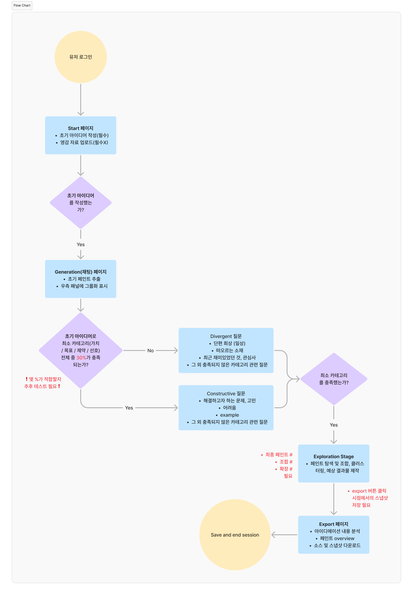

# 개발용 Docs

# **File Link**

- **피그마 Make - Idea Palette UI 0.6**

- **피그마 - 화면 설계서 0.6 ⇒ View에서 Annotation을 꼭 켜주세용!**

[https://www.figma.com/design/64hy70861COoSS8KMaIBDh/Idea-Palette-%ED%99%94%EB%A9%B4%EC%84%A4%EA%B3%84%EC%84%9C-0.6--%EA%B3%B5%EC%9C%A0%EC%9A%A9-?m=auto&t=21dgxPK3Glky6nPq-6](https://www.figma.com/design/64hy70861COoSS8KMaIBDh/Idea-Palette-%ED%99%94%EB%A9%B4%EC%84%A4%EA%B3%84%EC%84%9C-0.6--%EA%B3%B5%EC%9C%A0%EC%9A%A9-?m=auto&t=21dgxPK3Glky6nPq-6)

---

- **피그마 Make로 다운받은 코드 및 Make 파일**

[https://drive.google.com/file/d/1rW42zu1ldeZSfwq61KEevCSs9zRImNfW/view?usp=sharing](https://drive.google.com/file/d/1rW42zu1ldeZSfwq61KEevCSs9zRImNfW/view?usp=sharing)

[https://drive.google.com/file/d/1gkGiU9-3LGHFw_felTao3NDsm5fP3sOJ/view?usp=sharing](https://drive.google.com/file/d/1gkGiU9-3LGHFw_felTao3NDsm5fP3sOJ/view?usp=sharing)

# NOTES

- 향후 2-3주간 아래 내용 중 구현이 가능한 것/불가능한 것들을 구분하고 기획을 점차 확정지어가고자 합니다! 따라서 아래 저의 상상들이 바로 다 이뤄지지 않아도 되고, feasible 한지 여부 등 체크해주시면서 코멘트 남겨주시면 감사하겠습니다~! (피드백 환영합니다!)
- 아직 해결해야할 과제들은 아래와 같습니다
    - Bridge Paints를 어떻게 제시해줄 것인가
    - Generation 단계에서 대화 플로우를 어떻게 진행할 것인가 (현재로도 괜찮을지)
    - Export 구체화
    
    → 이 부분들에 대해서는 조금 더 고민할 시간이 필요할 것 같아요! 
    

너무너무 감사합니다 가겸님,, S2 저희 내년 카이 꼭 같이 가요!

**Docs 목차**

---

# 1. Idea Palette Overview

## 1-1) Overall Structure

Start (초기 입력 및 자료 업로드) → Generation Stage (LLM 대화) → Exploration Stage (Palette 전개, 노드 탐색 및 조합) → Export (Ideation Results)

**< Flowchart >**

**< 페이지 구성 >**

| Page | 설명 |
| --- | --- |
| Start | 사용자 초기 프롬프트 및 레퍼런스 입력
  • 현재 생각중인 아이디어 입력
  • 영감이 되는 키워드 및 레퍼런스 이미지, 자료 업로드 |
| Generation stage (Preinventive structures 생성) | LLM 대화 통해 preinventive structures (아이디어 물감) 추출
  • 우측 패널에서 실시간으로 어떤 물감들이 생성되고 있는지 표시 |
| Preinventive stuctures | 아이디어 물감
  • 아이디어의 기초 소재들
  •  generation stage에서의 대화를 기반으로 사용자에 따라 dynamic하게 palette의 cluster 생성
  • palette 상에서 멀티모달로 제시 |
| Exploration stage | LLM 대화 이후 Idea Palette 인터페이스 로 전환
  • 물감(preinventive structure)들을 cluster(팔레트 안의 팔레트)로 정리하여 제시 → Generation Stage에서 제시했던 cluster대로
  • 물감 조합 (상위 컨셉 만들기)
  • 물감 결합 시 예상 결과 보여주기
  • 6까지 exploration 방식에 따라 explore
  • text → image |

**주의할 점!**

- ai와 대화하며 추출하는 아이디어 재료들은 ‘의미가 덜 고정된’ **파편**들이어야 함 (완성된 형태의 아이디어 X, 정확한 목적 X)
- ai의 역할 ⇒ 해석을 대신 제시해준다거나, 의미를 고정시킨다거나.. exploration을 대신 해주는 역할이어선 안됨.
    - 질문을 던지거나. 여러 해석을 병렬로 제시한다거나.. 하는 방법 필요

## 1-2) Preinventive Structure 구성

| **구분** | **역할** | **구현** | **지식 그래프상의 위치** |
| --- | --- | --- | --- |
| **Explicit Paints** | 사용자의 의식적 키워드 | Entity Extraction | 기존 노드 (Nodes) |
| **Implicit Paints** | 발화 이면의 숨겨진 맥락 | Latent Embedding | 잠재 개념 (Latent Concepts) |
| **Bridge Paints** | 창의적 전이를 위한 매개체 | Path-finding / Analogy | 연결 엣지 (Inferred Edges) |
- **Explicit Paints: 사용자가 직접 말한 관심사**
    
    → 내가 이미 알고 있는 것
    
    → 사용자가 대화에서 명시적으로 언급한 컨셉, 소쟈
    
- **Implicit Paints: 여러 발화에서 반복되지만 명시적으로 대화에 나타나지는 않은 테마**
    
    → 내가 말했지만 인식 못한 것
    
    → 예: 사용자가 직접 "나는 고독이 테마야"라고 말하지 않아도, "밤 바다", "혼자 마시는 커피", "오래된 책방"이라는 단어들 사이에서 흐르는 공통 맥락을 통해 "고독"과 같은 상위 개념을 찾아서 동적으로 추가하고 기존 노드들이랑 연결
    
- **Bridge Paints: 멀리 떨어진 두 관심사를 이어지는 연결 후보 (추후 원격연상에 활용)**
    
    → 내가 연결하지 못한 것
    
    → 멀리 떨어진 두 노드들을 잇는 매개 노드 후보들을 미리 탐색/생성. 
    
    → llm이 새로 생성
    
- 참고: 원격 연상 (Associative Thinking)
    - Mednick (1962)의 associative theory는 **개인의 창의성 수준 = 연상 공간에서의 원격한 요소들을 조합하는 능력**임을 설명
    - 핵심 주장: 창의성은 “서로 멀리 떨어진 요소들 간의 새로운 연합을 형성하는 능력”이며, 창의적인 사람일수록 더 많은, 더 먼 연상을 생성할 수 있음
    - 실제로, ‘무관한 레퍼런스들을 제시하여 창의성을 돋구는 HAI 도구’ 연구 CHI 내에도 존재
        - 한계점: 단순히 랜덤하거나 관련성 낮은 레퍼런싱을 통해 컨셉아트 등의 창작에서 창의성을 높일수 있는지 없는지 수준의 검증. Ideation 작업에 어떻게 도움을 줄 수 있는지는 구체적 연구 X
        
    
    > *The associative theory of creativity argues that creativity is the process of combining mental elements and associative thinking can connect mental elements (Mednick, 1962). The possibility of getting a creative response is positively related to the distance between associative elements. The theory further argues that people with flat associative hierarchies, i.e., people who have weaker associations from an initial stimulus to a large set of elements, tend to be more creative.
    Similarly, Koestler (1964) argue that creativity results from "bisociation", an unexpected synthesis of elements from two thoughts into a new idea. In other words, creativity results from the association of two seemingly incompatible frames of reference within a new context. (Wang & Nickerson, 2017)*
    > 
    

<aside>
✅

**Generation(대화세션)을 통해 발굴한 페인트들을 3개 종류로 전개**

</aside>

<aside>
✅

**Exploration(팔레트모드)에서 Explicit, Implicit Paints를 발전 + Bridge Paints를 이용해 원격연상**

</aside>

---

# 2. 객체 정의

- **Session**
- **Graph Node**
- **Graph Edge**
- **Result / Output**

## 2-1) 세션

- `session_id`: 세션 고유 id
- `user_id`: 사용자 구분용
- `current_stage`: `"generation" | "exploration" | "result"`
- `created_at`, `updated_at`: 생성/수정 시간
- `status`: `"active" | "completed" | "archived"`
- `title`: 세션 이름

## 2-2) Graph Node

- `node_id`: 노드 id
- `session_id`: 세션 연결
- `node_type`: 노드 종류
    - `explicit entity`
    - `latent concept`
    - `brdige`
- `category`
    - `주제`
    - `감정`
    - **`가치(신념)`**
    - **`목표`**
    - `계획`
    - **`제약`**
    - `사용자 성격`
    - **`선호(취향)`**
    - `레퍼런스 작품제목(지식)` → 따옴표 필요
    - `레퍼런스 이미지`
    - `레퍼런스 사운드`
- `label`: 노드 이름
- `description`: 설명
- `source_message_ids`: 어떤 발화에서 나왔는지
- `source_terms`: 어떤 표현에서 추출됐는지
- `confidence`: 추론 신뢰도 %
- `created_at`: 생성 시각

- 참고: personalization 최소 category 관련 참조논문
    
    이런 논문들을 말씀하신 게 맞겠죠?! 정말 최소의 최소는.. 여기서 말하는 것들인 듯한데, 도메인이 딱 맞지는 않아서 더 적합한 걸 알고 계실 경우 공유 부탁드립니닷
    
    **Wahlster, W., & Kobsa, A. (1989). User models in dialog systems. *User models in dialog systems*, 4-34.**
    
    - 유저 맞춤화를 위해 필수적인 요소들을 다음과 같이 정리
        - 유저의 신념(Beliefs), 목표(Goals), 계획(Plans)
        - 유저의 지식 (Knowledge) 또는 전문성 (Expertise)
    - 그 외
        - 유저의 성격 특성 (Personality Traits), 선호도 (Preferences), 취향 (Tastes)
        - 유저의 이전 상호작용 이력 (Past Interaction History)
        - 유저의 '집단적 신념' (Collective Beliefs) 또는 '공식적 입장' (Official Stance)
    
    **Jannach, D., Manzoor, A., Cai, W., & Chen, L. (2021). A survey on conversational recommender systems. *ACM Computing Surveys (CSUR)*, *54*(5), 1-36.**
    
    대화형 추천 시스템(CRS)은 효과적인 사용자 맞춤형 추천을 제공하기 위해 다음 네 가지 핵심 정보를 수집하고 활용함
    
    1. 사용자의 선호도 (User Preferences): 사용자가 개별 항목에 대해 가지고 있는 긍정적 또는 부정적 평가, 좋아하거나 싫어하는 것, 또는 암묵적인 피드백 등
    2. 사용자의 필요사항 및 제약 조건 (User Needs and Constraints): 사용자가 항목에서 찾고자 하는 특정 기능, 속성, 또는 항목을 선택할 때 고려하는 명시적인 제한 사항이나 요구 조건
    3. 사용자 의도 (User Intents): 사용자가 대화를 통해 달성하려는 구체적인 목표나 목적. 예를 들어, 추천을 받고 싶다거나, 상품 정보를 얻고 싶다거나, 대화를 종료하고 싶다는 등의 의도를 파악하는 것.

<aside>
✅

- 필수요건(가치/목표/제약/선호) 각각에 대해 충족되면 대화 종료 (progress bar 활용)
- category는 유저별로 대화에 따라 추가되기도 함
- 대화 단계에서 우측 패널에는 personalization을 위한 category로 묶어서 보여주는 게 아니라, 그 대화 세션의 큰 주제들을 직접 생성해 묶어주기
</aside>

## 2-3) Graph Edge

- `edge_id`: 엣지 id
- `session_id`: 세션 연결
- `source_node_id`, `target_node_id`: 연결 대상
- `relation_type`: 관계 유형
    - `associates_with`
    - `contrasts_with`
    - `evokes`
    - `relates_to`
    - `echoes`
    - `inspires`
    - `avoids`
    - `wants_tone`
    - `is_unfinished`
- `weight`: 관계 강도
- `evidence_message_ids`: 이 관계의 근거가 된 메시지
- `created_at`: 생성 시각

<aside>
✅

**사용자별 동적 그래프**

기본 노드/엣지 구성은 정의해두되, 사용자에 따라 실시간으로 추가/변형

⇒ 사용자에 따른 preinventive structure 구성

</aside>

---

# 3. 페이지별 설명 및 기능 정의

## 3-1) Start Session

### 3-1-1) 설명

- 사용자 초기 input을 받기 위한 시작 페이지
- 해당 페이지에서 사용자는 초기 아이디어를 입력 및 레퍼런스 첨부
- 입력한 내용을 바탕으로 사용자가 어느 정도로 구체적인 초기 아이디어를 가지고 있는지 판단

### 3-1-2) 화면구성

- 초기 아이디어 작성창 (필수)
- 영감 자료 업로드 (필수X)

### 3-1-3) 주요기능

1. 초기 아이디어 텍스트 입력을 받음
2. 영감 자료 업로드 시 텍스트 입력을 받음 + 멀티모달 자료

### 3-1-4) 사용자 인터랙션 상세

1. 초기 아이디어 텍스트를 입력하면 하단 ‘채팅으로 시작하기’ 버튼 활성화
2. ‘참고자료 또는 자료 추가’ 부에 텍스트로 참고 작품(예: 영화제목) 입력
3. 첨부파일 업로드 - 이미지, 오디오, 노트 등

## 3-2) Generation Stage (채팅)

### 3-2-1) 설명

사용자가 자유롭게 아이디어를 이야기하며 생각을 풀어내는 단계

### 3-2-2) 화면구성

- 좌
    - 현재 진행 status
- 중
    - 채팅 창
    - progress bar
    - 메시지 입력창
    - 팔레트로 이동 버튼
- 우
    - 초기 페인트(preinventive structure) 추가 현황 패널 (키워드 및 클러스터)

### 3-2-3) 주요기능

1. 사용자 입력 기반 대화 및 메시지 저장
2. explicit paint / implicit paint / bridge paint 생성 및 저장
3. 대화 속 paint 재료들 동적 카테고라이징
    - 이 카테고리는 graph node 내 카테고리와는 별개임

### 3-2-4) 사용자 인터랙션 상세

1. 채팅 시 자동으로 preinventive structure 생성 및 프로그레스 바 진행
2. 우측 패널에 preinventive structure 고정: 필수로 포함시킬 페인트 지정
3. ‘팔레트로 이동’ 버튼: 프로그레스 바가 100에 도달시 활성화, 클릭 가능

### 3-2-5) 대화 Flow

1. Start 페이지에서 사용자가 입력한 초기 아이디어 및 자료를 기반으로 최소 카테고리(가치 / 목표 / 제약 / 선호)의 충족도 파악

→ 최소 카테고리 30% 기준 (테스트 필요)

1. 미만 시: Generation Stage 채팅은 Divergent 질문들로 시작 및 진행
    - 단편 회상(일상 회상)
    - 떠오르는 소재
    - 최근 재미있었던 것, 관심사
    - 그 외 충족되지 않은 카테고리 관련 질문
2. 충족 시: Generation Stage 채팅은 Constructive 질문들로 시작 및 진행
    - 현 상황에서 해결하고자 하는 문제, 고민
    - 어려움
    - 아이디어의 example
    - 그 외 충족되지 않은 카테고리 관련 질문
- 참고: Geneplore 모델에서 Generative Process 예시
    - Retrieval (회상): 기억에서 관련 개념·이미지 끌어오기
    - Association (연합): 연상 확장, 개념 간 연결 만들기
    - Synthesis (종합): 서로 다른 요소를 결합해 새로운 형태 만들기
    - Transformation (변형): 회전, 크기 변경, 왜곡 등 형태 변환
    - Analogical transfer (유추적 전이): 다른 영역의 구조를 가져와 비유·유추
    - Categorical reduction (범주적 축약): 범주를 축소하거나 핵심 특징만 남기기
1. 최소 카테고리 기준을 충족하였을 경우, ‘팔레트 이동’버튼 활성화, 그러나 대화는 지속 가능

⇒ 대화 flow 자체는 추후 더 테스트 해야할 것 같아요

## 3. Exploration Stage (팔레트)

### 3-3-1) 설명

- Generation Stage에서 생성하고 클러스터링한 페인트를 기반으로 페인트 탐색 및 조합을 하는 단계
    - 탐색: 하나의 페인트를 깊게 파고드는 것
    - 조합: 2개 이상의 페인트를 조합해 제3의 페인트를 생성하는 것

### 3-3-2) 화면구성

- 상
    - 컨트롤 버튼(확대축소, 정리), 휴지통, Export 버튼
- 중
    - 페인트 및 클러스터 카드 전개
- 우
    - 빠른 작업
    - llm 채팅

### 3-3-3) 주요기능 (피그마 3.1~ 순서와 동일)

1. **페인트 조합**: 2개 이상의 페인트를 선택하여 텍스트/이미지/비디오 형태의 새로운 페인트로 합성
2. **새 이미지 만들기 / 새 비디오 만들기**: 기존 페인트 카드를 클릭시 이미지 또는 비디오를 생성 가능
3. **특정 페인트 탐색**: 채팅을 통해 해당 페인트 내용을 확장하는 연결 페인트 생성
4. **페인트 수동 추가**: 새로운 페인트를 사용자가 직접 추가(text)
5. **페인트묶음(클러스터) 수동 추가**: 페인트끼리 묶여있는 클러스터를 사용자가 직접 추가
6. **페인트 수동 수정**: 페인트 이름, 상세 내용, 태그를 사용자가 직접 수정 가능
7. **페인트묶음(클러스터) 이름 수정**: 생성되어있는 클러스터의 이름을 타이핑하여 직접 수정 가능
8. **페인트묶음(클러스터) 삭제**
9. **페인트묶음(클러스터)에 페인트 추가**: 팔레트 상에 있는 모든 페인트를 해당 클러스터에 가져올 수 있음
10. **휴지통**: 페인트 카드 선택하여 삭제한 뒤 복원을 하고자 할 때 사용
11. **정리**: 산만하게 흩어진 카드를 일괄 정렬

### 3-3-4) 인터랙션 상세

**[ 마우스 및 키보드 인터랙션 정리 ]** 

- 🖱️ 왼쪽 클릭 (카드): 카드 선택 & 편집 모드 / 드래그
- 🖱️ 왼쪽 클릭 (빈 영역): 선택 해제
- 🖱️ 스크롤 버튼: 캔버스 위아래 이동 (pan)
- 🖱️ 휠 누른 채로 이동: 캔버스 상하좌우 이동 (pan)
- ⌨️ 키보드입력: content 수정, 태그 추가/삭제, 채팅

**[ 페인트 활용 인터랙션 ]** 

1. **페인트 조합**
    - 조합 시 기본적으로 텍스트 카드로 추가
2. **새 이미지 만들기 / 새 비디오 만들기**
    - 새 이미지 만들기, 새 비디오 만들기는 텍스트/이미지/비디오 페인트에서 모두 버튼 제시
    - 텍스트 페인트에서 진행시: 이미지/비디오 제안 → 사용자 피드백 → 팔레트에 추가
    - 이미지 카드에서 진행시, 기존에 이미지가 있으므로:
        - 이미지 만들기: '어떻게 수정하시겠습니까?' → 입력 → 제안 → 피드백 → 기존 카드 이미지 overwrite
        - 비디오 만들기: 누를 경우 제안 → 피드백 → 팔레트 추가
    - 비디오 카드에서 진행시, 기존에 비디오가 있으므로:
        - 이미지 만들기: 제안 → 피드백 → 팔레트 추가
        - 비디오 만들기: '어떻게 수정하시겠습니까?' → 입력 → 제안 → 피드백 → 기존 카드 비디오 overwrite
    
    ⇒ 참고: 이 부분의 로직을 피그마로 구현 하는 데에 계속 실패하고 있어요..!
    
3. **특정 페인트 탐색(채팅 - 연결페인트 추가)**
    - ‘빠른 작업(삭제, 조합, 새 이미지 만들기, 새 비디오 만들기)’ 버튼을 사용하지 않고, 텍스트로 llm과 바로 대화하며 특정 페인트에 대해 구체적으로 구상하는 과정
    - llm은 다음과 같은 질문들을 물어봄: “이 페인트를 보면 어떤 느낌이 드세요?”, “어떤 개념으로 볼 수 있을까요?”, “다른 의미는 없을까요?”, “(사용자 입력 어려움/고민을 바탕으로) 어떤 해결방법을 줄 수 있을까요?”
        - 참고: Geneplore 모델에서 Exploration 예시
            - Attribute finding (속성 찾기)
                - systematic search for emergent features in the preinventive structures
                - ex) a person might generate a novel mental image consisting of an unusual combination of parts and then mentally scan the image to determine if any emergent features are present
            - Conceptual interpretation (개념적 해석): “이걸 어떤 개념/기능으로 볼 수 있을까?” 해석
                - the process of taking a preinventive structure and finding an abstract, metaphorical, or theoretical interpretation of it.
                - ex) a preinventive structure might be interpreted as representing a new concept in medicine, an idea for the plot of a story, an extension of the theory of relativity, or a theme for a musical composition
            - Functional inference (기능적 추론): 실제로 가능한 용도·기능을 상상하기
                - the process of exploring the potential uses or functions of a preinventive structure
                - ex) one might imagine how a preinventive object form could be used as a particular tool, a piece of furniture, or a device for catching a burlar
            - Contextual shifting (맥락적 전이): 기존 제약을 느슨하게 해서 다른 의미 찾기
                - considering a preinventive structure in new or different contexts as a way of gaining insights about other possible uses or meanings of the structure
                - this process often helps to overcome fixation effects and other obstacles to creative discovery
            - Hypothesis testing (가설 검증): 어떤 문제를 위한 가능한 솔루션으로서 preinventive structure를 해석하기
                - one seeking to interpret the structures as representing possible solutions to a problem
                - ex) a person working on a problem in geometry might generate preinventive structures that represent various solution possibilities and then explore the implications of these structures for solving the problem
            - Searching for limitations (한계 찾기): 불가능한 영역을 파악함으로써 길을 좁히기
                - preinventive structures can also provide insights into which ideas will not work or what types of solutions are not feasible. this is often just as important as actually discovering what will work. discovering limitations can help to restrict future searches and focus creative exploration in more promising directions
                - ex) when people generate exemplars for novel categories, they often discover that their initial creations are limited in important respects. they might then explore those limitations, leading to the creation of more appropriate exemplars
    - 사용자의 응답을 압축, llm이 재제시 → 해당 turn에서 나온 소재가 마음에 들 경우, 채팅창에 뜨는 ‘+ 연결 페인트로 추가하기’ 버튼을 눌러, 팔레트 상에 기존 페인트에 연결된 카드로 생성
4. **페인트 수동 수정**
    - 페인트 더블 클릭시 페인트 이름 및 제목, 태그 수정 가능
5. **페인트 수동 추가**
    - 하단 + 버튼 클릭시 페인트 추가 버튼 출력
    - 추가된 페인트는 모든 클러스터 외부에 생성
6. **페인트 삭제**
    - 페인트 클릭시 우측 ‘빠른 작업’에 삭제 버튼 출력
    - 삭제 시 해당 페인트는 휴지통으로 이동
7. **삭제된 페인트 다시 불러오기**
    - 상단 ‘휴지통’ 클릭시, 삭제된 페인트 복원 가능
8. **오디오 / 비디오 재생**
    - 팔레트 상 오디오, 비디오 재생 버튼 클릭시 별도의 모달창을 통해 재생

**[ 페인트묶음 활용 인터랙션 ]** 

- **페인트묶음(클러스터) 수동 추가**
    - 하단 + 버튼 클릭시 페인트묶음 추가 버튼 출력
    - 모달창 통해 페인트묶음 이름과 색상 지정
    - 추가된 페인트묶음은 default로 하나의 빈 페인트를 포함
- **페인트묶음(클러스터) 이름 수정**
    - 페인트묶음 이름 클릭시 이름 직접 수정 가능
- **페인트묶음(클러스터) 삭제**
    - 페인트묶음 이름 클릭시 우측에 ‘페인트묶음 삭제’ 버튼 출력
    - 페인트묶음을 삭제하더라도, 내부에 있던 페인트는 삭제되지 않으며 다른 클러스터들의 외부영역에 남음
- **페인트묶음(클러스터)에 페인트 추가**
    - 페인트묶음 이름 옆의 ‘+’ 버튼 클릭시, 모달창 팝업을 통해 해당 클러스터에 추가할 페인트 지정 가능

**[ 컨트롤 인터랙션 ]**

- **줌인 줌아웃**
    - 상단 돋보기 버튼 통해 줌인줌아웃
- **정리하기**
    - 상단 ‘정리’ 버튼을 통해 전체 카드 정렬
- **스냅샷**
    - 하단 ‘스냅샷’ 버튼 통해 현재 팔레트 전체 상태를 이미지 형태로 캡쳐 (화면에 보이는 영역만이 아니라 전체 팔레트)
    - 메타데이터로 시간 포함
- **export**
    - 상단 ‘Export’ 버튼 클릭시, 페인트 분석 진행 및 결과 창으로 이동
- **휴지통**
    - 상단 ‘휴지통’ 버튼 클릭시, 삭제된 페인트들이 포함된 모달 팝업 출력. 페인트 위로 마우스 hover시 복원 버튼이 나타나며 클릭시 팔레트 원 위치에 배치.

**[ 기타 UI 요소 ]** 

- **카드 아이콘**
    - 각 페인트는 우측 상단에 아이콘으로 explicit paint / implicit paint / combined paint / bridge paint 를 표현
    - 사람 모양: explicit paint
    - 전구 모양: implicit paint
    - c : combined paint
    - b: 고민중

### 3-3-5) 아직 고민중인 부분

- bridge 페인트 응용법: 어떤 종류의 브릿지 페인트가 나오는지 보고 난 후 기능 추가해도 될까요?

## 3-4) Export Page (결과)

### 3-4-1) 설명

- Generation과 Exploration 단계를 거치며 생성된 페인트 및 소스 자료를 정리하고, 그것을 토대로 AI 분석 제공
- **어떻게 더 구체화할지는 구상 중!**

### 3-4-2) 화면구성

- 좌
    - 최종 팔레트상 남은 paint들
- 우
    - 내보내기
    - 팔레트 스냅샷
    - AI 분석

### 3-4-3) 주요기능

1. 최종 팔레트상 남은 Paint Overview
2. 전체 다운로드
    - 내보내기 영역에 포함된 자료 및 전체 스냅샷을 일괄 다운로드
3. 내보내기
    - pdf: 전체 페인트 종류, 생성된 이미지 및 비디오 종류, AI 분석을 pdf 템플릿으로 제공하는 걸 생각 중..
    - 이미지: 생성된 이미지 소스
    - 비디오: 생성된 비디오 소스
4. 팔레트 스냅샷 (현재는 실제 스냅샷을 넣을 수 없어 임의 의미지)
    - 팔레트에서 explore하는 과정에서 ‘스냅샷’버튼을 통해 찍은 팔레트 현황을 이미지로 제공
5. AI 분석
    - 작업 중인 아이디어의 수렴 방향, 탐구 영역, 의미, 해석, 흐름 등을 분석하여 제공

### 3-4-4) 인터랙션 상세

1. 다운로드: 전체 자료 일괄 다운로드
2. PDF, 이미지, 비디오 다운로드
3. 스냅샷 다운로드